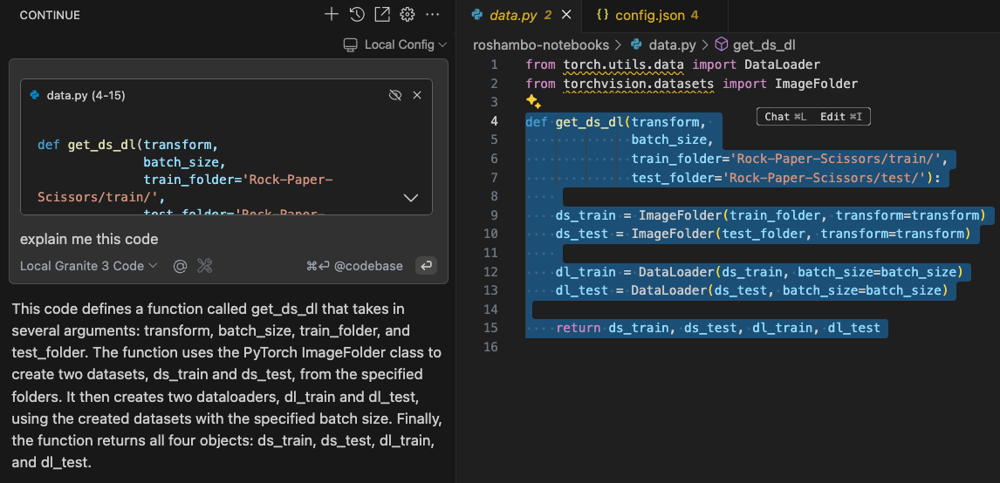

## Demo Podman AI + Continue + VSCode == Awesome Local Code Assistant

1. Install Continue package extension in VSCode
2. Make sure that your Code Assistant LLM (in this case Granite 3 Code GGUF) is deployed and running
3. Open the configuration and paste the config.json example in [here](config.json)
4. Change/adapt the port used for the LLM into the config.json
5. Open the Chat with `Command+L` or `Shift+L`
6. Enjoy! 

* Chat with your Code Assistant

* Explain some code and improve it!

