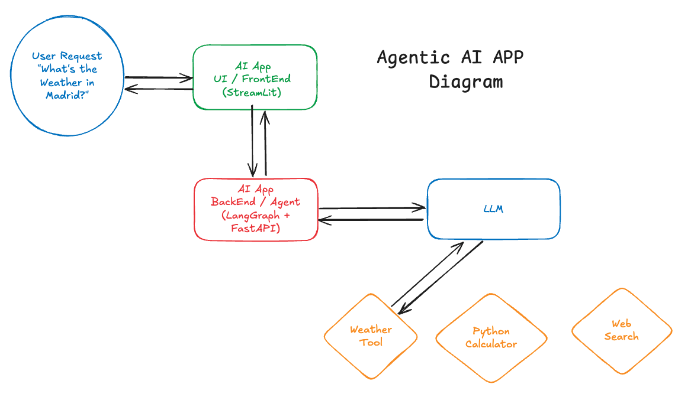

## Agentic APP



* Install the dependencies using UV:

```bash
uv venv
source .venv/bin/activate
uv pip install -r
```

* Deploy the Agent/Backend:

```bash
cd demos/agentic-app && source .venv/bin/activate
export MODEL_NAME="bartowski/granite-3.1-8b-instruct-GGUF"
export API_KEY="None"
export API_URL="http://localhost:57364"
python backend/app.py
```

* Deploy UI/FrontEnd:

```bash
cd demos/agentic-app && source .venv/bin/activate
export BACKEND_URL="http://localhost:8080"
streamlit run frontend/app.py
```

### Prompts to Try

```md
give me the largest rivers in the world and sum the distance
```

```md
Calculate the area of a circle with a radius of 7 meters and then determine how many such circles would fit into a square with a side length of 100 meters
```

### Screenshots

* Example 1:


* Example 2:


* Example 3:


