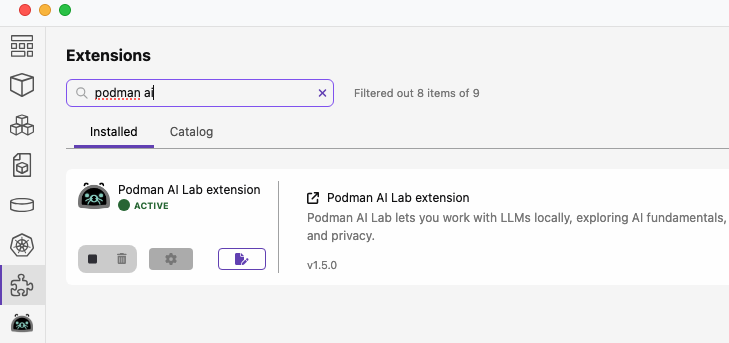
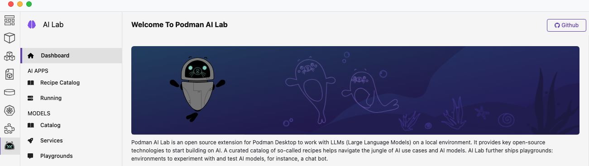
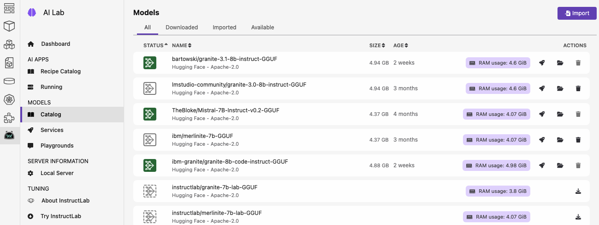
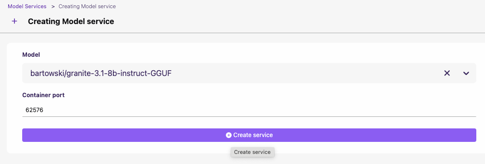
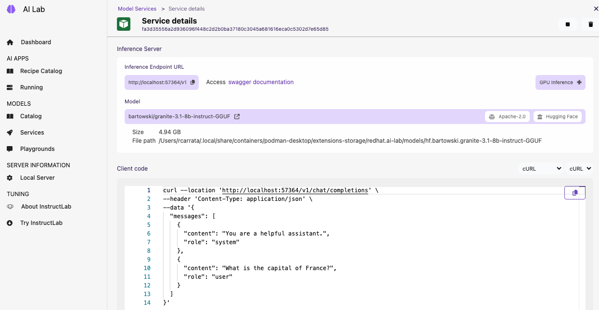
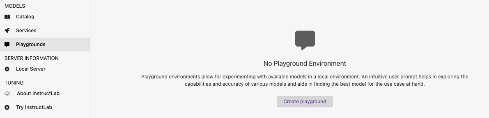
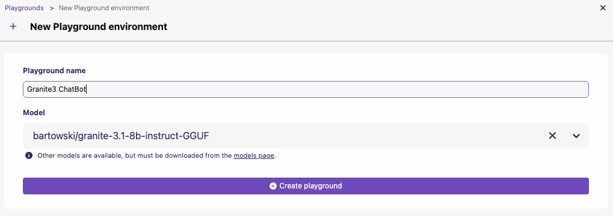
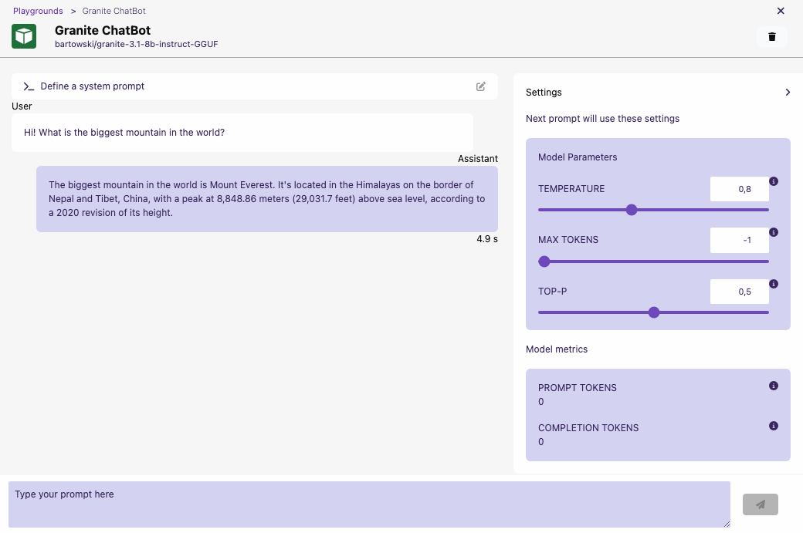

## Enable and Serve Local LLMs with Podman AI

Podman AI Lab is an open source extension for Podman Desktop to work with LLMs (Large Language Models) on a local environment. It provides key open-source technologies to start building on AI. A curated catalog of so-called recipes helps navigate the jungle of AI use cases and AI models. AI Lab further ships playgrounds: environments to experiment with and test AI models, for instance, a chat bot.

### Deploy Local LLM with Podman AI

* Enable Podman AI Extension:

* Go to the Podman AI Dashboard:

* Check the Model Catalog and Download the model of your choice:

> NOTE: we are using 
`bartowski/granite-3.1-8b-instruct-GGUF` and `ibm-granite/granite-8b-code-instruct-GGUF` on this demo.

* Go to Model -> Services and Create a new Service with the model downloaded before:

* And voilà! After a couple of minutes you're ready to rock with your new local LLM!

### Test your Local LLM with Podman AI Playground

The integrated Playground environments allow for experimenting with available models in a local environment. An intuitive user prompt helps in exploring the capabilities and accuracy of various models and aids in finding the best model for the use case at hand.

Once started, each playground ships with a generic chat client to interact with the model service. The Services page allows for accessing running model services and provides further details and code snippets to interact with them.

* Go to Models -> Playground and Create new playground:

* Give a meaningful name to your playground and select the Model Deployed:

* Try with a prompt like `Hi! What is the biggest mountain in the world?` and see the results!:

